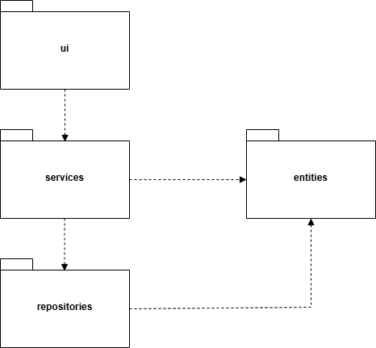
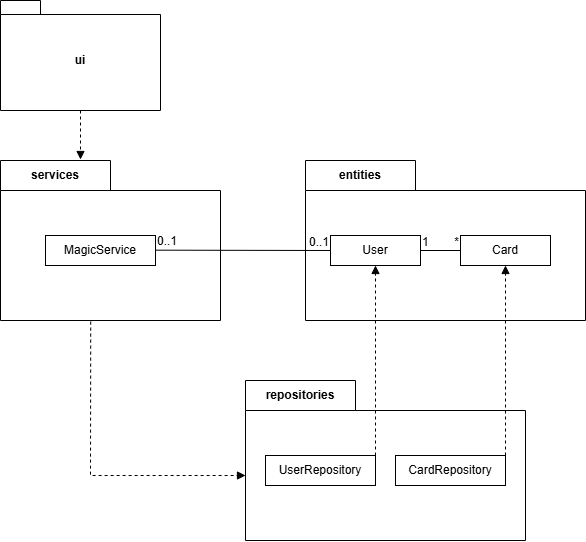
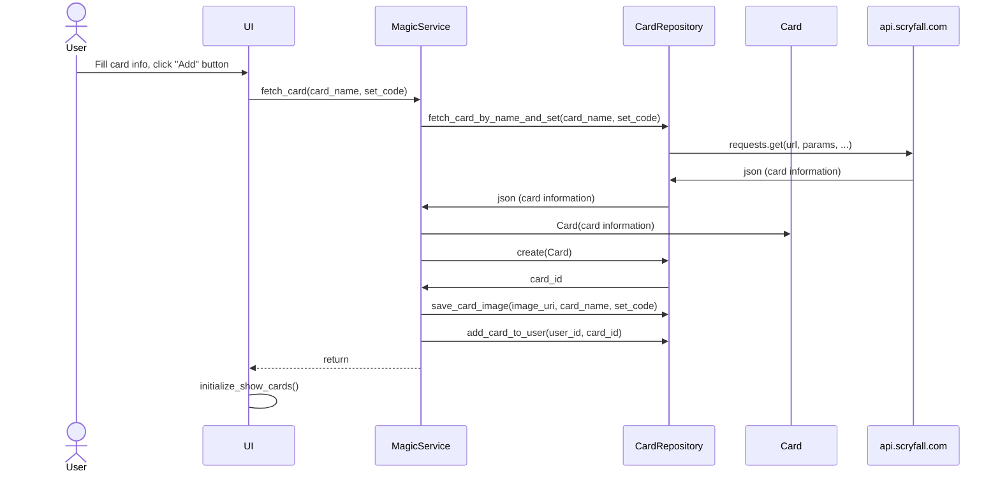
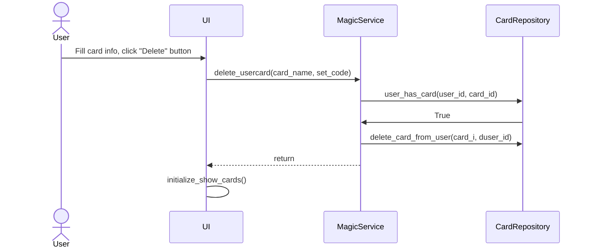

# Architecture Description

## Structure

The application has the following code package structure:

The **ui** package contains the code responsible for the user interface, **services** handles the application logic, and **repositories** is responsible for data persistence. The **entities** package contains classes that represent the data objects used by the application.

## User interface

The user interface includes three different views:

- Login
- Create new user
- Card view

Every view is its own class and is separated from the application logic, which it will access through [MagicService](../src/services/magic_service.py) class methods. 

## Application Logic

The following class/package diagram describes the application logic and relationship between **UI**, **MagicService** class and the rest of the application. **MagicService** has access to application users and card operations through [UserRepository](../src/repositories/user_repository.py) and [CardRepository](../src/repositories/card_repository.py). 

## Data storing

Repository classes are responsible for storing **Users** and **Cards**. *Users* are stored completely in SQlite database. The basic data fields of *Cards* are stored in SQlite database, but card images are stored on disk in folder `/images` for efficiency reasons when loading image thumbnails into card view. A card with the same name can be found in several cards sets and for that reason card image filenames contain both the card name (e.g. "Firebolt") and set code (e.g. "ema" for Eternal Masters -set). With this example the filename would be 'firebolt_ema.png'.

## Main functionalities

Here are two most important functionalities of the software described as a sequence diagram.

### Fetching and adding a new card into collection

The most important sequence diagram describes **fetching a new Magic the Gathering card** into the application:

When fetching a new card, the application operates as follows:

After user clicks 'Add' button, card info is passed on to `MagicService` which in turn calls `CardRepository` to fetch the card information from api.scryfall.com in json format. After `MagicService` gets card information, it creates a Card object and then calls `CardRepository` to save the card data into database and card image to disk. The card is then assigned to current user. UI card view then updates the new card to the card view.

### Removing a card from collection

When the user "deletes" card from their collection, the card information and image stays in database/disk. Only the connection between the card and user is deleted. User must input both card name and set to exlude cards with same name from other card sets.

After user clicks 'Delete' button, MagicService checks whether the card is in users collection. If it is, then MagicService asks CardRepository to delete the connection between the card and current user. Finally UI card view is updated accordingly.

## Known issues in application architecture

- There are FOUR special card-layouts for certain Magic the Gathering cards: 'split', 'flip', 'transform' and 'modal_dfc'. For these cards certain data is not located in the "root" of the Cards -table in the database. For example Creature -cards "power" for double sided cards (tramsform, modal_dfc) is not located in column "power", but instead can be found in column "card_faces" that includes a list with two jsons, one for each side of the card. This must be taken into account when implementing for example search features that include these kind of data fields.