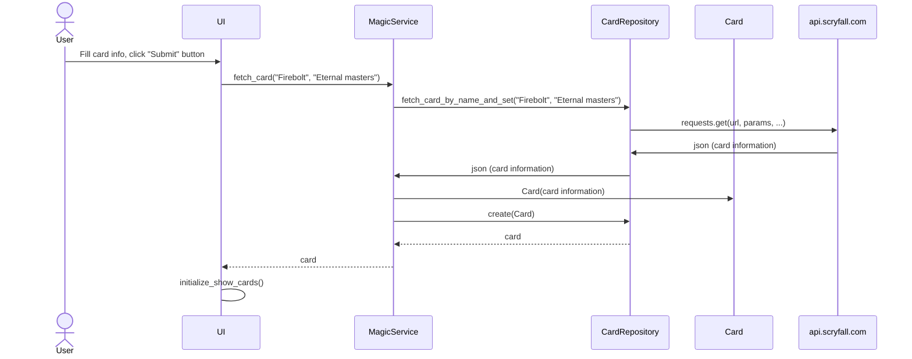

# Architecture Description

## Structure

The application has the following code package structure:

The **ui** package contains the code responsible for the user interface, **services** handles the application logic, and **repositories** is responsible for data persistence. The **entities** package contains classes that represent the data objects used by the application.

## Application Logic

The following class/package diagram describes the application logic and relationship between the MagicService class and the rest of the application:

**NOTE: in the future diagram will include classes/packages responsible for connecting to Scryfall API**

## Main functionalities

A couple of sequence diagrams describing a few important functionalities in the app.

### Fetching Magic cards from api.scryfall.com

When fetching a new card, the application operates as follows:

After user clicks Submit button, card info is passed on to `MagicRepository` which in turn calls `CardRepository` to fetch the card information from api.scryfall.com in json format. After `MagicRepository` gets card information, it creates a Card object and then calls `CardRepository` to save the card into database with method `create`. UI main view then updates the new card in the card list.
