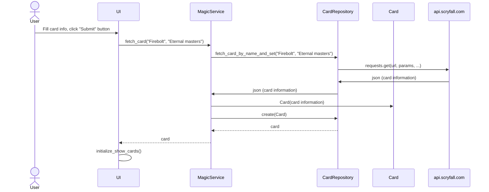

# Architecture Description

## Structure

The application has the following code package structure:

The **ui** package contains the code responsible for the user interface, **services** handles the application logic, and **repositories** is responsible for data persistence. The **entities** package contains classes that represent the data objects used by the application.

## User interface

The user interface includes three different views:

- Login
- Create new user
- Card view

Every view is its own class and is separated from the application logic, which it will access through [MagicService](../src/services/magic_service.py) class methods. 

## Application Logic

The following class/package diagram describes the application logic and relationship between **UI**, **MagicService** class and the rest of the application. **MagicService** has access to application users and card operations through [UserRepository](../src/repositories/user_repository.py) and [CardRepository](../src/repositories/card_repository.py). 

## Data storing

Repository classes are responsible for storing **Users** and **Cards**. *Users* are stored completely in SQlite database. The basic data fields of *Cards* are stored in SQlite database, but card images are stored on disk in folder `/images` for efficiency reasons when loading image thumbnails into card view.

## Main functionalities

The most important sequence diagrams describing **fetching a new Magic the Gathering card** into the application:

When fetching a new card, the application operates as follows:

After user clicks Submit button, card info is passed on to `MagicService` which in turn calls `CardRepository` to fetch the card information from api.scryfall.com in json format. After `MagicService` gets card information, it creates a Card object and then calls `CardRepository` to save the card data into database and card image to disk. UI main view then updates the new card to the card view.
