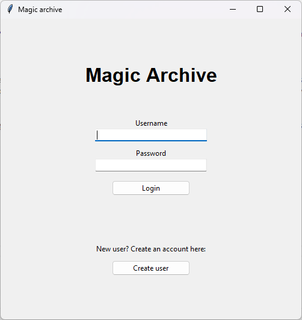
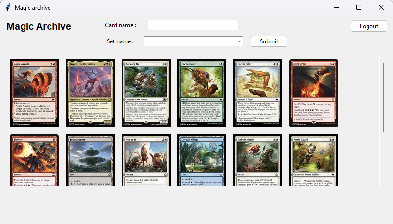

# User Guide

First download the latest [release](https://github.com/jtpcode/ot-harjoitustyo/releases).

## Configuration

The filenames used for storage can optionally be configured in a `.env` file located in the root directory. The files will be automatically created in the **data** directory. The format of the .env file is as follows:

```
DATABASE_PATH=./data/magic_database.db
USER_AGENT=MagicArchive
```
USER_AGENT is needed for accessing api.scryfall.com and can be chosen freely.

## Starting the Application

Before starting the application, install the dependencies with the command:

1. Install dependencies with the following command:

```bash
poetry install --no-root
```

2. Initialize application database with:

```bash
poetry run invoke build
```

3. Start the application with:

```bash
poetry run invoke start
```

## Login

The application will start in login view. Use **Create user** first to acquire credentials. Then you can login normally.



## Card view

Here you can see the cards stored in your collection in alphabetical order. Same card can be in different card sets as a reprint, so you need to use both the card and set name. You can add new cards by typing the card name and choosing a corresponding card set, then click 'Add'. If you want to remove a card from your collection, type in the name and set of the card, then click 'Delete'.

NOTE:
- You can use "simpler" name format when adding/deleting cards, e.g. "Hunter's Talent" is equivalent to "hunters talent".
- Set names in the dropdown menu are preloaded at startup from api.scryfall.com, because new sets are published every few months.
- Double sided cards: current version of the application only loads the image of the "first" side of a double sided card. All the card info is still saved in the database.

Here are some example cards with corresponding sets for you to try out:

- Blooming Blast, Bloomburrow
- Cache Grab, Bloomburrow
- Hop to It, Bloomburrow
- Firebolt, Eternal Masters
- Firebolt, Odyssey


