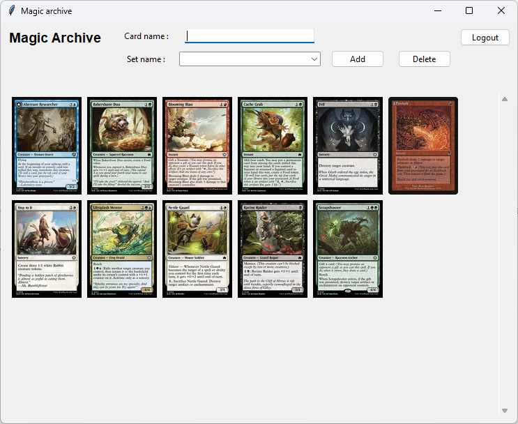

# User Guide

First download the latest [release](https://github.com/jtpcode/ot-harjoitustyo/releases).

## Configuration

The filenames used for storage can optionally be configured in a `.env` file located in the root directory. The files will be automatically created in the **data** directory. The format of the .env file is as follows:

```
DATABASE_PATH=./data/magic_database.db
USER_AGENT=MagicArchive
```
USER_AGENT is needed for accessing api.scryfall.com and can be chosen freely.

## Starting the Application

Before starting the application, install the dependencies with the command:

1. Install dependencies with the following command:

```bash
poetry install
```

2. Initialize application database with:

```bash
poetry run invoke build
```

3. Start the application with:

```bash
poetry run invoke start
```

## Login

The application will start in login view. Use **Create user** first to acquire credentials. Then you can login normally.

## Card view

Here you can see the cards stored in the database. You can add new cards by giving the card name and choosing a corresponding card set, then click add.


