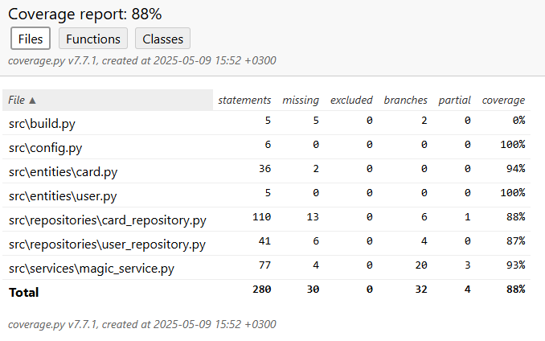

# Testing Documentation

The application has been tested using both automated unit and integration tests with `unittest`. System-level testing was performed manually. Currently, the user interface is not  automatically tested.

## Unit and Integration Testing

### Application Logic

The application logic class `MagicService` is tested in the [TestMagicService](https://github.com/jtpcode/ot-harjoitustyo/blob/main/src/tests/services/magic_service_test.py) test class. `MagicService` instance is initialized with injected **mock repositories** for *Card* and *User*. Required responses from the repositories are mocked when needed.

### Repository Classes

The repository classes `UserRepository` and `CardRepository` are tested using a database that is specifically set up for testing. The database name is configured in the `.env.test` file. The `UserRepository` class is tested in the [TestUserRepository](https://github.com/jtpcode/ot-harjoitustyo/blob/main/src/tests/repositories/user_repository_test.py) test class, and the `CardRepository` class in the [TestCardRepository](https://github.com/jtpcode/ot-harjoitustyo/blob/main/src/tests/repositories/card_repository_test.py) test class.

Mocking is used in CardRepository for example when accessing api.scryfall.com and writing to disk. A fake card is also used, which is provided in [test utils](../src/utils/test_utils.py).

### Test Coverage

Excluding the user interface, the branch coverage of the application is 88%.

## System Testing

System testing of the application was performed manually.

### Installation and Configuration

The application was tested as described in the [user guide](./manual.md) on Linux environment. Testing was also done in Win11 environment with the exception that `invoke` task don't work directly. The application was tested in situations where database already existed and in situation where application created them automatically.

### Functionality

All features listed in the [requirements specification](./requirements_specification.md) and the [user guide](./manual.md) were tested. Input fields were also tested with invalid values, such as empty inputs and invalid card/set information. Also tested for deleting non-existing cards and adding for existing cards.

## Known Quality Issues

- The application does not provide error messages in UI if SQLite database is not initialized before starting the application.
- Currently, the user interface is not  automatically tested.
