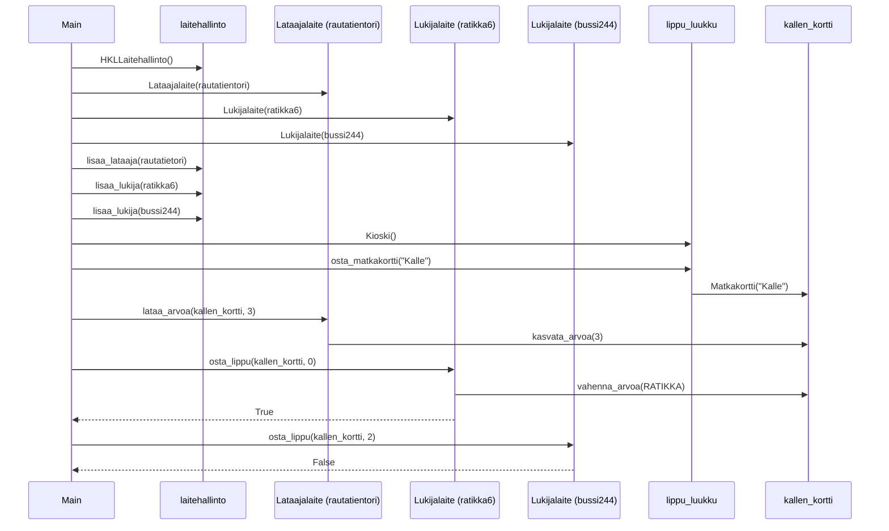

## HSL-matkakortti: sekvenssikaavio

```mermaid
    sequenceDiagram
    participant Main
    participant laitehallinto
    participant Lataajalaite (rautatientori)
    participant Lukijalaite (ratikka6)
    participant Lukijalaite (bussi244)
    participant lippu_luukku
    participant kallen_kortti
    
    Main->>laitehallinto : HKLLaitehallinto()
    Main->>Lataajalaite (rautatientori): Lataajalaite(rautatientori)
    Main->>Lukijalaite (ratikka6): Lukijalaite(ratikka6)
    Main->>Lukijalaite (bussi244): Lukijalaite(bussi244)
    
    Main->>laitehallinto : lisaa_lataaja(rautatietori)
    Main->>laitehallinto : lisaa_lukija(ratikka6)
    Main->>laitehallinto : lisaa_lukija(bussi244)
    
    Main->>lippu_luukku: Kioski()
    Main->>lippu_luukku: osta_matkakortti("Kalle")
    lippu_luukku->>kallen_kortti: Matkakortti("Kalle")
    
    Main->>Lataajalaite (rautatientori): lataa_arvoa(kallen_kortti, 3)
    Lataajalaite (rautatientori)->>kallen_kortti: kasvata_arvoa(3)
    
    Main->>Lukijalaite (ratikka6): osta_lippu(kallen_kortti, 0)
    Lukijalaite (ratikka6)->>kallen_kortti: vahenna_arvoa(RATIKKA)
    Lukijalaite (ratikka6)-->>Main: True
    
    Main->>Lukijalaite (bussi244): osta_lippu(kallen_kortti, 2)
    Lukijalaite (bussi244)-->>Main: False
```
