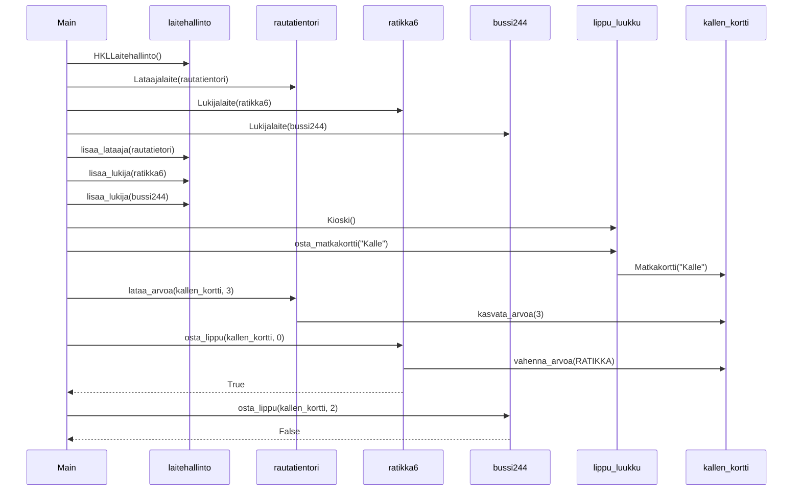

## HSL-matkakortti: sekvenssikaavio

```mermaid
    sequenceDiagram
    participant Main
    participant laitehallinto
    participant rautatientori
    participant ratikka6
    participant bussi244
    participant lippu_luukku
    participant kallen_kortti
    
    Main->>laitehallinto : HKLLaitehallinto()
    Main->>rautatientori: Lataajalaite(rautatientori)
    Main->>ratikka6: Lukijalaite(ratikka6)
    Main->>bussi244: Lukijalaite(bussi244)
    
    Main->>laitehallinto : lisaa_lataaja(rautatietori)
    Main->>laitehallinto : lisaa_lukija(ratikka6)
    Main->>laitehallinto : lisaa_lukija(bussi244)
    
    Main->>lippu_luukku: Kioski()
    Main->>lippu_luukku: osta_matkakortti("Kalle")
    lippu_luukku->>kallen_kortti: Matkakortti("Kalle")
    
    Main->>rautatientori: lataa_arvoa(kallen_kortti, 3)
    rautatientori->>kallen_kortti: kasvata_arvoa(3)
    
    Main->>ratikka6: osta_lippu(kallen_kortti, 0)
    ratikka6->>kallen_kortti: vahenna_arvoa(RATIKKA)
    ratikka6-->>Main: True
    
    Main->>bussi244: osta_lippu(kallen_kortti, 2)
    bussi244-->>Main: False
```
