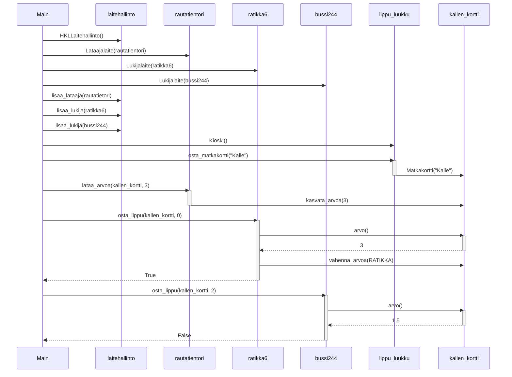

## HSL-matkakortti: sekvenssikaavio

```mermaid
    sequenceDiagram
    participant Main
    participant laitehallinto
    participant rautatientori
    participant ratikka6
    participant bussi244
    participant lippu_luukku
    participant kallen_kortti
    
    Main->>laitehallinto : HKLLaitehallinto()
    Main->>rautatientori: Lataajalaite(rautatientori)
    Main->>ratikka6: Lukijalaite(ratikka6)
    Main->>bussi244: Lukijalaite(bussi244)
    
    Main->>laitehallinto : lisaa_lataaja(rautatietori)
    Main->>laitehallinto : lisaa_lukija(ratikka6)
    Main->>laitehallinto : lisaa_lukija(bussi244)
    
    Main->>lippu_luukku: Kioski()
    Main->>lippu_luukku: osta_matkakortti("Kalle")
    activate lippu_luukku
    lippu_luukku->>kallen_kortti: Matkakortti("Kalle")
    deactivate lippu_luukku
    
    Main->>rautatientori: lataa_arvoa(kallen_kortti, 3)
    activate rautatientori
    rautatientori->>kallen_kortti: kasvata_arvoa(3)
    deactivate rautatientori

    Main->>ratikka6: osta_lippu(kallen_kortti, 0)
    activate ratikka6
    ratikka6->>kallen_kortti: arvo()
    activate kallen_kortti
    kallen_kortti-->>ratikka6: 3
    deactivate kallen_kortti
    ratikka6->>kallen_kortti: vahenna_arvoa(RATIKKA)
    ratikka6-->>Main: True
    deactivate ratikka6
    
    Main->>bussi244: osta_lippu(kallen_kortti, 2)
    activate bussi244
    bussi244->>kallen_kortti: arvo()
    activate kallen_kortti
    kallen_kortti-->>bussi244: 1.5
    deactivate kallen_kortti
    bussi244-->>Main: False
    deactivate bussi244
```
